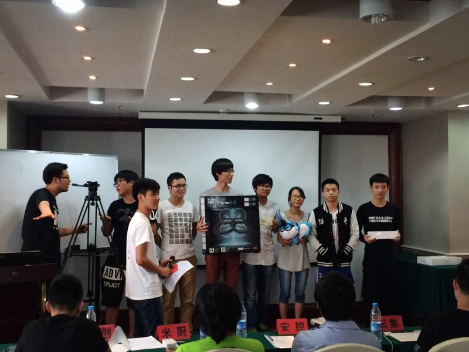
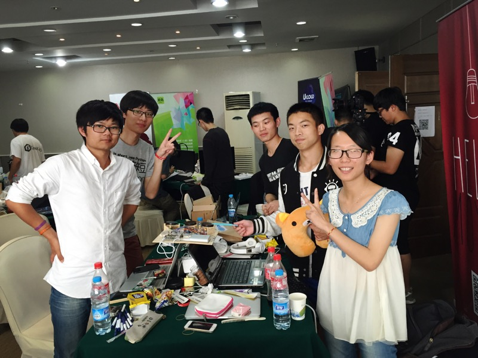
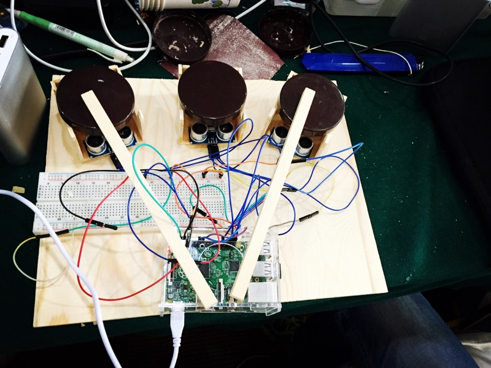
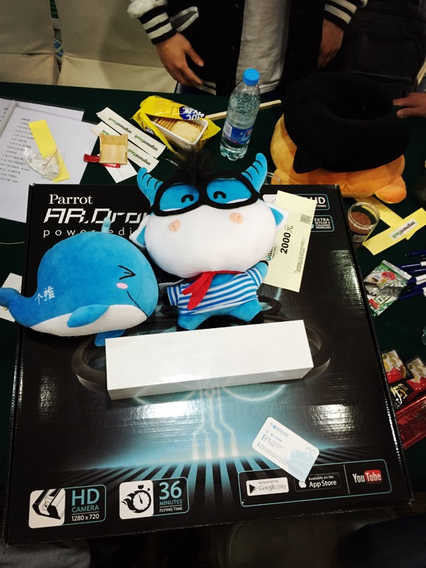
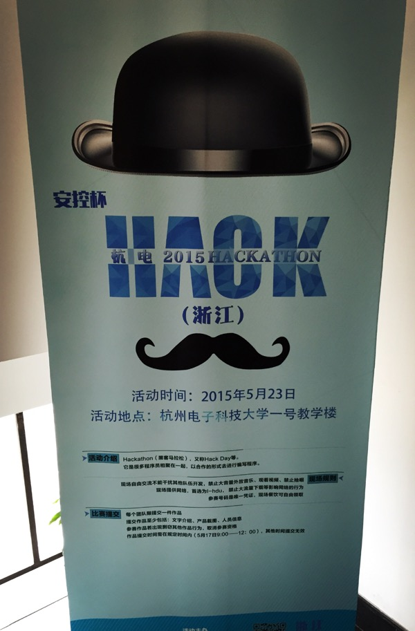

# 灵魂鼓手

灵魂鼓手是2015杭电安控杯黑客马拉松24小时作品，本次比赛获得了全场二等奖。

通过树莓派接通3个传感器，对应3个鼓面，开始游戏时候，web端跳出地鼠，通过敲击对应鼓面打击地鼠得分。

 

# 路演稿

大家好，我们的作品名称叫灵魂鼓手。

今天带大家玩一个很有意思的游戏，边打鼓变玩打地鼠的小游戏。

通过树莓派接通3个传感器，对应3个鼓面，开始游戏时候，web端跳出地鼠，通过敲击对应鼓面打击地鼠得分。

下面，让我们的队友向大家玩一玩这个小游戏：

首先，我们开始游戏。

为了鼓面抖动，我们加入防抖算法，所以，我们要求队员在限定的时间内，连续敲击出2下作为一个节拍，一个节拍代表一个敲击动作。

这里，我们的主干代码，都在现场所写，包括逻辑和创意也都是先场讨论结果。

大家可以到页面上的链接登陆Github查看我们的push记录。

 

# Brain Storm

12点确认
15点确认
18点确认
21点确认

模型：

1.arduino+xyz 轴控制加速度大小-难度加速度

2.树莓派+arduino界面

3.树莓派

c-s-c模型：

web端：鼓+socket

树莓派端：频率+键音

频率，先放
音键，3个thread

socket+鼓震动+多线程结合

 

# About 

